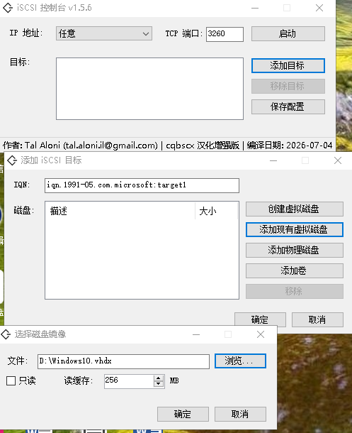

About iSCSI Console:
====================
iSCSI Console is a Free, Open Source, User-Mode iSCSI Target Server written in C#.
iSCSI Console is cross-platform, portable and requires no installation.
iSCSI Console can serve physical and virtual disks to multiple clients.

This fork / 本分支更新
=====================

本分支主要更新：

1. 中文界面汉化，便于中文 Windows 环境直接使用。
2. 增加 VHDX 支持，可创建、打开并作为 iSCSI LUN 提供给客户端。
3. 修复 VHDX 写入时 `DiscUtils.Vhdx.ContentStream.Flush()` 未实现导致的写入异常。
4. 打开被占用的 VHDX 时支持只读回退，避免直接崩溃。
5. 新增命令行启动模式，可不打开 GUI，直接用一个 VHD/VHDX 文件启动 iSCSI Target。
6. 命令行启动时会尝试自动添加 Windows 防火墙 TCP 3260 入站规则，减少首次启动时的手动干预。

Command line target mode:
=========================
Use a VHD or VHDX path as the first argument to serve that image as one iSCSI target:

```bat
iSCSIConsole.exe D:\VHDSYS\example.vhdx
```

The default target IQN suffix is the disk image file name without extension. The command above uses:

```text
iqn.1991-05.com.microsoft:example
```

You can set the IQN suffix with the second argument:

```bat
iSCSIConsole.exe D:\VHDSYS\example.vhdx pc01
```

This uses:

```text
iqn.1991-05.com.microsoft:pc01
```

You can also pass a full IQN as the second argument:

```bat
iSCSIConsole.exe D:\VHDSYS\example.vhdx iqn.2026-07.local.lab:pc01
```

Optional arguments:

- `/listen <ip>`: listen address. Use `0.0.0.0` for all interfaces. Default is all interfaces.
- `/port <port>`: TCP port. Default is `3260`.
- `/readonly`: open the disk image read-only.
- `/status <path>`: write `READY ...` or `ERROR ...` status text for scripts.
- `/stopfile <path>`: exit when this file appears.

About the iSCSI library:
========================
The iSCSI library utilized by iSCSI Console was designed to give developers an easy way to serve block storage via iSCSI.
Any storage object you wish to share needs to implement the abstract Disk class, and the library will take care of the rest.
The library was written with extensibility in mind, and was designed to fit multitude of projects.
iSCSI Console is merely a demo project that exposes some of the capabilities of this library.

A NuGet package of the library [is available](https://www.nuget.org/packages/ISCSI/).

Notes:
------
In addition to a full fledged iSCSI Target server implementation, the iSCSI library also contain a very basic iSCSI initiator implementation.

What this program can do:
===================================
1. Serve virtual disks (VHD / VHDX / VMDK / IMG).
2. Serve physical disks.
3. Serve basic volumes as disks.
4. Serve dynamic volumes as disks.
5. Create VHDs.
6. Can run under Windows PE using Mono.
7. Can run under Linux / OSX using Mono (use the release targeting .NET Framework 4.7.2)



Contact:
========
If you have any question, feel free to contact me.
Tal Aloni <tal.aloni.il@gmail.com>
