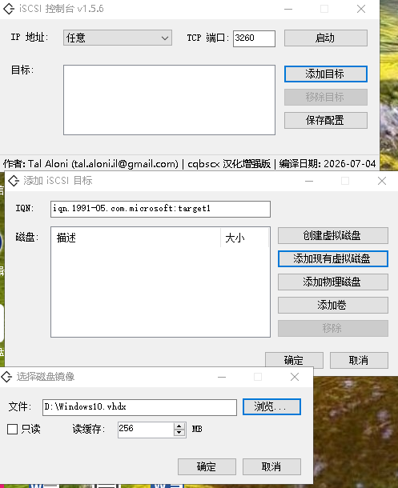

About iSCSI Console:
====================
iSCSI Console is a Free, Open Source, User-Mode iSCSI Target Server written in C#.
iSCSI Console is cross-platform, portable and requires no installation.
iSCSI Console can serve physical and virtual disks to multiple clients.

This fork / 本分支更新
=====================

本分支主要更新：

1. 中文界面汉化，便于中文 Windows 环境直接使用。
2. 增加 VHDX 支持，可创建、打开并作为 iSCSI LUN 提供给客户端。
3. 修复 VHDX 写入时 `DiscUtils.Vhdx.ContentStream.Flush()` 未实现导致的写入异常。
4. 打开被占用的 VHDX 时支持只读回退，避免直接崩溃。
5. 新增命令行启动模式，可不打开 GUI，直接用一个 VHD/VHDX 文件启动 iSCSI Target。
6. 命令行启动时会尝试自动添加 Windows 防火墙 TCP 3260 入站规则，减少首次启动时的手动干预。
7. GUI 可保存当前服务配置，命令行可按配置文件启动或停止服务。
8. 后台服务支持运行中添加、移除、查看和保存 VHD/VHDX Target，无需重启服务。
9. 命令行、后台服务和 GUI 为 VHD/VHDX 磁盘镜像提供只读块缓存；单磁盘模式默认 256MB，动态服务目标默认 16MB，写入会自动清理相关缓存块，可用 `/cachemb 0` 关闭。
10. 修正 READ(6) / WRITE(6) 长度为 0 时应表示 256 个块的兼容性问题。
11. 增强虚拟磁盘目标的 SCSI 兼容性，补充 READ/WRITE/VERIFY(12)、SYNCHRONIZE CACHE(16) 等常见命令处理。
12. 改进 `/stop`，停止请求会立即关闭服务；若服务进程短时间内未退出，会按状态文件中的进程号终止。
13. 修复写缓存语义：SYNCHRONIZE CACHE(10/16) 和 FUA 写入会将 VHD/VHDX 数据真正刷新到物理存储。
14. 增加 `/singleclient`，按首个发起端来源 IP 锁定可写 Target，允许同一客户机在 iPXE 到 Windows 交接期间重连，并拒绝其它机器。
15. 动态目标可用 `/initiator <iqn>` 绑定唯一发起端 IQN，适合一台客户机对应一个差分 VHDX 的无盘机房。
16. 修复动态移除目标后 SCSI 工作线程不退出的问题；现在会先停止并排空该目标命令队列，再释放 VHD/VHDX 句柄。
17. 管理管道支持并发请求，并为动态移除增加显式 `/force`，便于集中启动或回收 50-80 个独立客户机目标。

Command line target mode:
=========================
Use a VHD or VHDX path as the first argument to serve that image as one iSCSI target:

```bat
iSCSIConsole.exe D:\VHDSYS\example.vhdx
```

The default target IQN suffix is the disk image file name without extension. The command above uses:

```text
iqn.1991-05.com.microsoft:example
```

You can set the IQN suffix with the second argument:

```bat
iSCSIConsole.exe D:\VHDSYS\example.vhdx pc01
```

This uses:

```text
iqn.1991-05.com.microsoft:pc01
```

You can also pass a full IQN as the second argument:

```bat
iSCSIConsole.exe D:\VHDSYS\example.vhdx iqn.2026-07.local.lab:pc01
```

Optional arguments:

- `/listen <ip>`: listen address. Use `0.0.0.0` for all interfaces. Default is all interfaces.
- `/port <port>`: TCP port. Default is `3260`.
- `/readonly`: open the disk image read-only.
- `/singleclient`: lock this target to the first initiator source IP until the target process stops. This is recommended for a writable boot/update image.
- `/cachemb <MB>`: read cache size for VHD / VHDX disk images. Default is `256`; use `0` to disable.
- `/status <path>`: write `READY ...` or `ERROR ...` status text for scripts.
- `/stopfile <path>`: exit when this file appears.

When `/log <path>` is enabled, cache statistics are written when a cached disk is released.

A writable VHD/VHDX must not be mounted by several Windows clients at the same time. Use one differencing disk per client for concurrent diskless boot, or use `/singleclient` when only one machine may boot the selected writable image for maintenance and update. `/singleclient` only limits login ownership; when the selected image is a differencing VHDX, writes remain in that child and its parent chain is opened read-only.

Saved service configuration:
============================
The GUI can save the current target list to `iSCSIConsole.service.xml` in the program directory.
The saved configuration includes the listen address, TCP port, target IQNs and supported disks.
For VHD / VHDX disk images, the GUI can also save the read cache size.

Supported saved disk types:

- VHD / VHDX disk image path.
- Physical disk index.
- Windows volume GUID.

Start the saved service configuration without opening the GUI:

```bat
iSCSIConsole.exe /start
```

Use a custom configuration file:

```bat
iSCSIConsole.exe /start /config D:\iSCSI\targets.xml
```

Stop a service started from the same configuration:

```bat
iSCSIConsole.exe /stop
iSCSIConsole.exe /stop /config D:\iSCSI\targets.xml
```

`/stop` can also stop a single-disk service started by passing a VHD / VHDX path directly.

Add a VHD / VHDX target while the saved service is already running:

```bat
iSCSIConsole.exe /addtarget D:\iSCSI\001122AABBCC.vhdx pc-001122aabbcc
```

For a classroom target, bind the child disk to the initiator IQN assigned to that client's MAC address:

```bat
iSCSIConsole.exe /addtarget D:\iSCSI\children\001122AABBCC.vhdx pc-001122aabbcc /initiator iqn.2026-08.cn.bscx:mac-001122aabbcc
```

The iPXE script for that client must set the same `initiator-iqn` before `sanboot`. A future controller can create/delete the differencing VHDX itself, then use `/addtarget` and `/removetarget` only to control the corresponding IQN service.

Use `/cachemb <MB>` with command line target mode or `/addtarget` to change the read cache size for that disk image. `/addtarget` defaults to 16MB so that 80 targets have at most about 1.25GB of user-space read cache; Windows can still share cached pages from the common read-only parent file. Saved service configuration stores this value as `CacheSizeMB` on each disk image entry.

`/singleclient` is intended for the current single-machine maintenance workflow. It is not needed for classroom targets when every client has a unique child target protected by `/initiator`.

Remove, list, or save runtime targets:

```bat
iSCSIConsole.exe /removetarget pc-001122aabbcc
iSCSIConsole.exe /list
iSCSIConsole.exe /save
```

Normal removal refuses a target that still has an active or retained iSCSI session. A controller that has intentionally stopped the client can use `/removetarget <target> /force`; this disconnects the remaining session, drains queued SCSI commands, flushes the child image and releases its file handles. Dynamic classroom targets will normally also use `/nosave` so stale per-client targets are not restored after a service restart.

About the iSCSI library:
========================
The iSCSI library utilized by iSCSI Console was designed to give developers an easy way to serve block storage via iSCSI.
Any storage object you wish to share needs to implement the abstract Disk class, and the library will take care of the rest.
The library was written with extensibility in mind, and was designed to fit multitude of projects.
iSCSI Console is merely a demo project that exposes some of the capabilities of this library.

A NuGet package of the library [is available](https://www.nuget.org/packages/ISCSI/).

Notes:
------
In addition to a full fledged iSCSI Target server implementation, the iSCSI library also contain a very basic iSCSI initiator implementation.

What this program can do:
===================================
1. Serve virtual disks (VHD / VHDX / VMDK / IMG).
2. Serve physical disks.
3. Serve basic volumes as disks.
4. Serve dynamic volumes as disks.
5. Create VHDs.
6. Can run under Windows PE using Mono.
7. Can run under Linux / OSX using Mono (use the release targeting .NET Framework 4.7.2)



Contact:
========
If you have any question, feel free to contact me.
Tal Aloni <tal.aloni.il@gmail.com>
